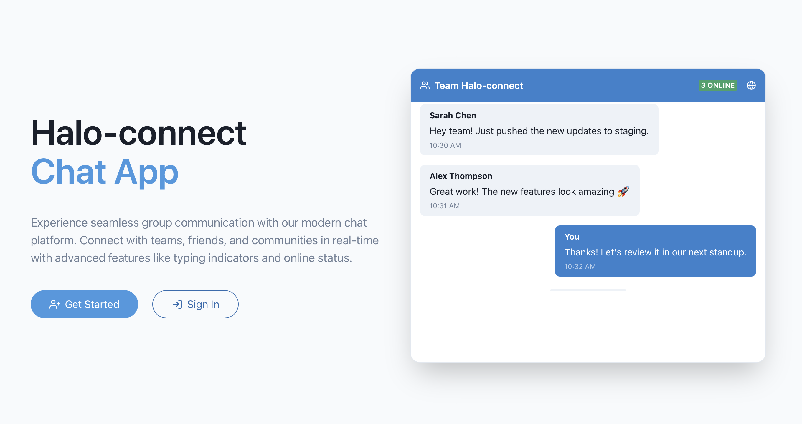
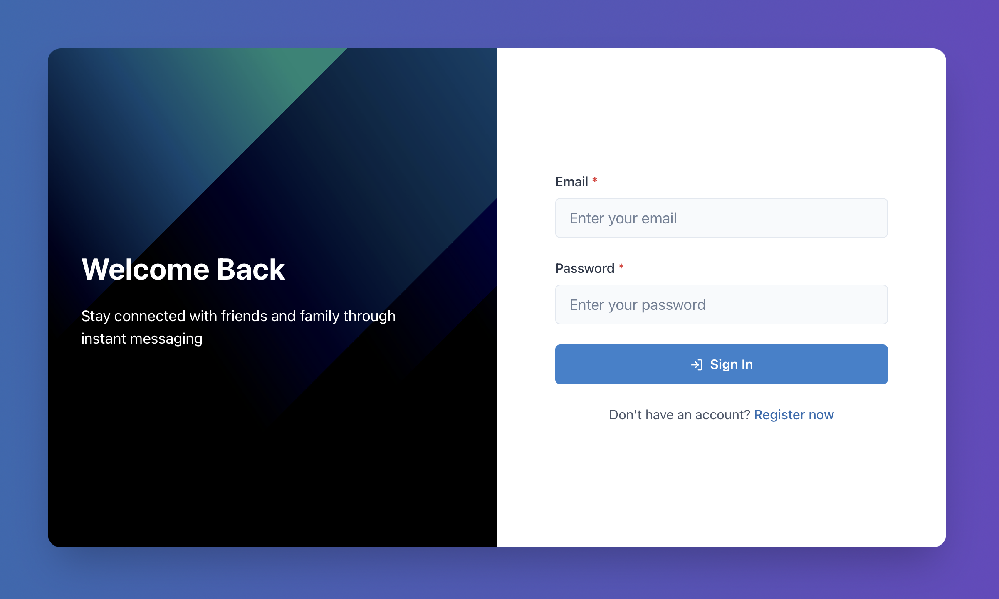
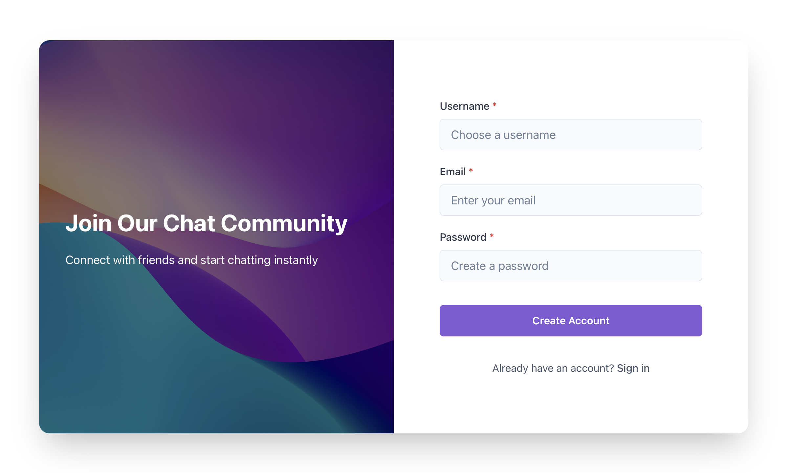
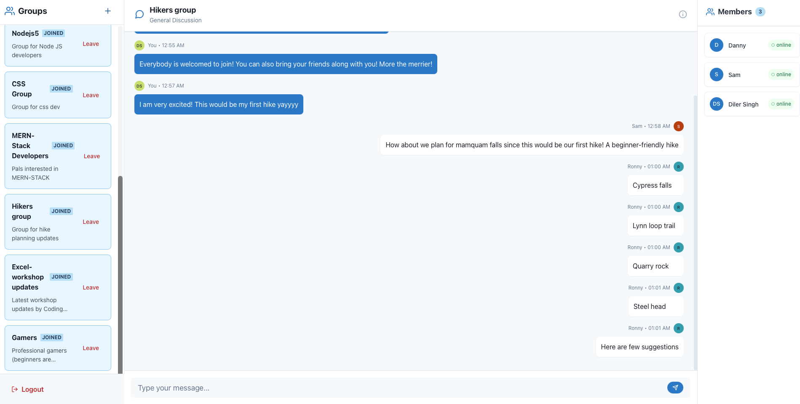

# Real-Time Chat Application

A full-stack real-time chat application with user authentication, group messaging, and online presence tracking. Built with React, Node.js, Express, MongoDB, and Socket.IO.

## Live Demo

🔗 [https://halo-connect.netlify.app](https://halo-connect.netlify.app)

---

## Screenshots

<div align="center">
  
  
</div>

<div align="center">
  
  
</div>

---

## Features

- **User Authentication** – Secure registration and login with JWT
- **Group Chat** – Create and join group conversations
- **Real-Time Messaging** – Instant message delivery using WebSockets
- **Online Status** – View which users are currently online
- **Message History** – Persistent chat storage in MongoDB
- **Admin Controls** – Elevated permissions for group creation
- **Responsive Design** – Modern UI with Chakra UI and Tailwind CSS

---

## Technology Stack

### Frontend

- React 18
- Vite
- React Router
- Chakra UI
- Tailwind CSS
- Socket.IO Client
- Axios

### Backend

- Node.js
- Express.js
- MongoDB + Mongoose
- Socket.IO
- JWT Authentication
- Bcrypt

---

## Project Structure

```
chat-app/
├── client/          # React frontend
│   ├── src/
│   │   ├── components/
│   │   ├── pages/
│   │   └── App.jsx
│   └── package.json
└── server/          # Node.js backend
    ├── controllers/
    ├── models/
    ├── routers/
    ├── middlewares/
    ├── server.js
    └── socket.js
```

---

## Getting Started

### Prerequisites

- Node.js (v14 or higher)
- MongoDB Atlas account or local MongoDB instance

### Installation

1. **Clone the repository**

   ```bash
   git clone <repository-url>
   cd chat-app
   ```

2. **Install server dependencies**

   ```bash
   cd server
   npm install
   ```

3. **Install client dependencies**

   ```bash
   cd ../client
   npm install
   ```

4. **Configure environment variables**

   **Server (.env in `server` directory):**

   ```env
   # Database
   MONGODB_URI=your_mongodb_connection_string

   # JWT Authentication
   JWT_SECRET=your_jwt_secret_key

   # Server Configuration
   PORT=5000

   # Client URL (for CORS)
   CLIENT_URL=http://localhost:5173
   ```

   **Client (.env in `client` directory):**

   ```env
   # API Base URL
   VITE_API_URL=http://localhost:5000

   # Socket.IO Server URL
   VITE_SOCKET_URL=http://localhost:5000
   ```

5. **Run the application**

   Start the server:

   ```bash
   cd server
   npm start
   ```

   Start the client (in a new terminal):

   ```bash
   cd client
   npm run dev
   ```

6. **Access the application**

   Open your browser and navigate to `http://localhost:5173`

---

## API Endpoints

### Authentication

- `POST /api/users/register` – Register a new user
- `POST /api/users/login` – User login

### Users

- `GET /api/users/get-current-user` – Get current user profile
- `GET /api/users/get-online-users/:groupId` – Get online users in a group

### Groups

- `POST /api/groups/create-group` – Create a new group (Admin only)
- `GET /api/groups/get-all-groups` – Get all available groups
- `POST /api/groups/join-group` – Join a group
- `POST /api/groups/leave-group` – Leave a group

### Messages

- `POST /api/messages/send-message` – Send a message
- `GET /api/messages/:groupId` – Get messages for a group

---

## Socket Events

### Client → Server

- `join-group` – Join a group chat room
- `send-message` – Send a message to a group
- `leave-group` – Leave a group chat room

### Server → Client

- `receive-message` – Receive new messages
- `online-users-updated` – Update online users list

---

## Author

Made by **Kalpana**

---
